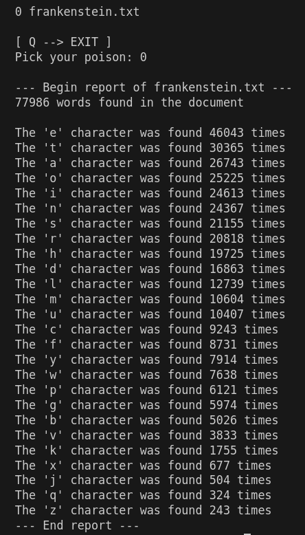

# bookbot

**BookBot** - generate report of the word and letter counts from your book.

> This project is part of Boot.dev course series.    

* Written in: `Python`
* Level: `Beginner`

```sh
	# Save your tome in the 'books' folder
    mv your_book bookbot/books/your_book
	# Run the script in terminal
    ./bookbot.py
	# Choose which one you want to check
    0
	# Voilà!
```
